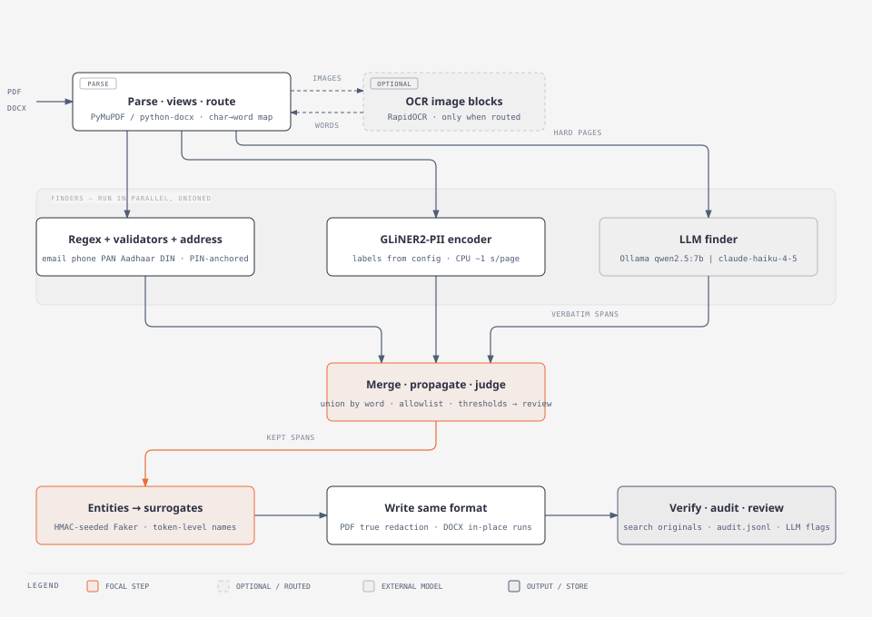

# PII Redaction Tool

This tool finds personal information in PDF and Word documents and replaces it with realistic fake information.

For example:

```text
Sarthak Malvadkar       -> Rohan Deshpande
sarthak@example.com     -> rohan.deshpande@example.com
```

The same real value gets the same replacement everywhere in the document. The output keeps the original file type
and tries to preserve the original layout.

**Evaluation report:** [View the full Claude report](https://claude.ai/artifact/5xUfowKhS8MqsAhhFP5rCJ)

## Simple workflow



1. **Read the document** and locate its text and images.
2. **Detect personal information** such as names, email addresses, phone numbers, addresses, and ID numbers.
3. **Replace each detected value** with a consistent fake value.
4. **Check the finished document** to make sure the original values are no longer present.

## Tools used

| Part | Tool | What it helps with |
|---|---|---|
| Read PDF files | PyMuPDF | Reads text and remembers where it appears on the page. |
| Read Word files | python-docx | Reads and updates text, tables, headers, footers, links, and images. |
| Read text inside images | RapidOCR | Finds text in scanned pages and document images. |
| Detect fixed formats | Regular expressions and validators | Finds emails, phones, PAN, Aadhaar, DIN, GSTIN, IFSC, cards, SSNs, IPs, and dates of birth. |
| Detect names and organisations | GLiNER2-PII | Finds names, organisations and other PII in running text. Chosen over Presidio/spaCy because its labels come from our config at run time (a new PII type needs no model training), it is trained on PII specifically, and it runs locally on CPU. |
| Check difficult pages | Ollama or Claude | Provides an optional second check when normal detection may miss something. |
| Create replacements | Faker | Creates realistic fake names, companies, addresses, and other values. |

The tool combines these detection methods because no single method finds every kind of personal information.

## What it detects

- Names
- Email addresses and phone numbers
- Home and office addresses
- Private companies, banks, law firms, auditors, and trusts
- Dates of birth
- PAN, Aadhaar, DIN, GSTIN, IFSC, SSN, card numbers, and IP addresses

Public organisations and general document information, such as SEBI, BSE, NSE, laws, page numbers, monetary
amounts, and filing dates, are left unchanged.

## Run it

```bash
uv venv --python 3.12
source .venv/bin/activate
uv pip install -e ".[dev]"

python -m pii_redact.cli samples/rhp.pdf
python -m pii_redact.cli samples/rhp.docx
```

To run without the optional LLM checks:

```bash
python -m pii_redact.cli samples/rhp.pdf --no-llm --no-review
```

To start the upload API:

```bash
uvicorn pii_redact.api:app
```

## Output

Each run creates a folder under `out/<document-id>/` containing:

- The redacted PDF or Word document
- `mapping.csv`: the original values and their replacements
- `review.csv`: uncertain findings that need human review
- `summary.json`: the result of the run and the final leak check
- `audit.jsonl`: a technical activity log

`mapping.csv` contains the original personal information and must be kept private.

## Quality checks

The test set contains 199 manually labelled examples across 14 document pages. The latest recorded result found
96.5% of the labelled personal information (recall 0.965), and 94.6% of its detections were correct (precision 0.946);
F1 0.955, token accuracy 0.984. Every change and its score is logged in `eval/RUNS.md`.
Full report with per-type numbers, misses and false hits: https://claude.ai/artifact/5xUfowKhS8MqsAhhFP5rCJ

Run the automated tests with:

```bash
pytest -q
```

Detailed architecture, evaluation, limitations, and future plans are in [DESIGN.md](DESIGN.md) and
[eval/LATEST_REPORT.md](eval/LATEST_REPORT.md).
